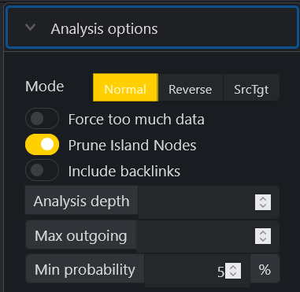
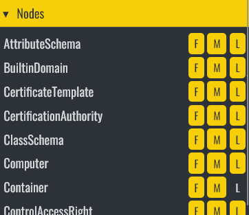

# adalanche: Active Directory ACL Visualizer and Explorer

*adalanche* gives instant results, showing you what permissions users and groups have in an Active Directory. It is useful for visualizing and exploring who can take over accounts, machines or the entire domain, and can be used to find and show misconfigurations.

## I Can Haz Domain Admin?

Active Directory security is notoriously difficult. Small organizations generally have no idea what they're doing, and way too many people are just added to Domain Admins. In large organizations you have a huge number of people with different needs, and they are delegated access to varying degrees of power in the AD. At some point in time, someone makes a mistake, and that can cost you dearly.

### Download

adalanche is an all-in-one binary - it collects information from Active Directory or from local Windows machines and can the analyze the collected data. If you're only doing AD analysis, just grab the binary for your preferred platform. Later you can deploy the dedicated collector .exe for your Windows member machines via a GPO or other orchestration and get even more insight.

Download either the latest release or the build of the latest commit from [Releases](https://github.com/lkarlslund/adalanche/releases). Usually running with the latest commit is fine, but there might be a problem here and there. Releases are considered stable and are for the less adventurous.

### Build it yourself

If you prefer full control, you can roll your own:

- Install go 1.18
- <code>git clone https://github.com/lkarlslund/adalanche</code>
- <code>cd adalanche-master</code>
- Windows: <code>build.cmd</code>
- Linux/OSX: <code>./build.sh</code>

## First run - full auto

If you're running adalanche on a Windows domain joined machine should just work *without any parameters*, as adalanche tries to autodetect as much as it can. Under this scenario, and with parameters given, you will run in a collect-analyze mode (collect from Active Directory, then analyze).

For more advanced use (recommended) first collect, with proper options. All your data files (are belong to us), and will end up in the data subfolder (or use <code>--datapath dir</code> to use an alternative folder).

See program options for other possibilities (help or command --help).

## Collecting data

### Active Directory
The primary source of data is from Active Directory, and is intiated with this command:

<code>adalanche collect activedirectory [--options ...]</code>

If you're on a non-domain joined Windows machine or another OS, you'll need at least the <code>--domain</code> parameter, as well as username and password (you'll be prompted for password if adalanche needs it and you didn't provide it on command line - beware of SysMon or other command line logging tools that might capture your password).

LDAPS (TLS over port 636) is default. If you're on a lab, and you haven't set up CA yet, you will get connection errors because the computer doesn't trust the AD cert. Either disable certificate validation with the "--ignorecert" switch, or change protocol to LDAP with <code>--tlsmode NoTLS --port 389</code> options.

Example to create data files file for contoso.local coming from your Linux pwnage box using TLS port 636, ignoring certs and using NTLM auth:

<code>adalanche collect activedirectory --ignorecert --domain contoso.local --authdomain CONTOSO --username joe --password Hunter42</code>

From domain joined Windows member using current user:

<code>adalanche collect activedirectory</code>

From domain joined Windows machine using other credentials than logged in:

<code>adalanche collect activedirectory --authmode ntlm --username joe --password Hunter42</code>

There are more options available, for instance on what LDAP contexts to collect, whether to collect GPOs or not etc. Please be aware that you can collect GPOs from Linux by mounting sysvol locally and pointing adalanche to this path for GPO collection - but you will lose ACL analysis for the individual files.

### LDAP RESULT CODE 49

*There is a limitation in the LDAP library that adalanche uses, which can result in this error: "LDAP Result Code 49 "Invalid Credentials": 8009030C: LdapErr: DSID-0C0906B5, comment: AcceptSecurityContext error, data 52e, v4563".*

This is usually "Channel Binding" or "Signing" requirements for SSL enabled connections over LDAP, as part of Microsofts hardening efforts on making LDAP more secure. 

Here are suggested alternative solutions:

#### Dump data over plaintext LDAP

Use this command:

<code>adalanche collect activedirectory --port 389 --tlsmode NoTLS</code>

#### Dump data using SysInternals AD Explorer

The SysInternals AD Explorer (adexplorer64.exe) is an enhanced GUI application that allows you to poke around in all objects and see all attributes. It leverages the Windows LDAP library (just like Users & Computers etc.) This supports both "Channel Binding" and "Signing" for LDAP transport. It also has a handy "snapshot" feature, that allows you do dump the entire AD into a proprietary file, which adalanche can ingest as an alternative to talking directly to LDAP.

The procedure for using AD Explorer as a data source is:

- Launch 'adexplorer64.exe'
- Connect to your domain, for simple setups you can just leave all fields blank and press connect
- Choose File | Create snapshot ... and save the file somewhere. There is no progress indicator, so just have patience
- Run adalanche to collect Active Directory object and GPO data:
<code>adalanche collect activedirectory --adexplorerfile=yoursavedfile.bin</code>

You will then have compressed AD data and GPO data in your datapath like a normal collection run. You can delete the AD Explorer data file now, as this is converted into adalanche native format.

## Gathering Local Machine data (Windows)

For Windows systems that are members of your Active Directory domain (or standalone) you can collect more information from the local machines by running the collector module. There is a stand alone version released as a 32-bit Windows executable, and this works transparently also on 64-bit systems. The idea is that you orchestrate it centraliy with a Scheduled Task via a GPO or whatever means you see fit (psexec, login script etc). 

The collector does not require elevated privileges, and runs fine with either the local system account with pricileges stripped or as a random user.

<code>adalanche-collector --outputpath \\\\some\\share\\where\\youcanwrite\\butnotread</code>

You can run the local machine collector from the adalanche binary too, but this is only included in the 64-bit Windows build:

<code>adalanche collect localmachine [--options ...]</code>

Please remember to secure your collection repository UNC path, so member machines can only create/write/modify files, but not read from them. Only you - the analyst - should be able to do so.

The files will automatically be imported into adalanche when you run it, if they're part of your datapath (in a subfolder or just copied in - whatever works for you)

This will give you insight into who uses what systems, service accounts that are domain users, autoadminlogins, who are local admins, who can RDP into systems and more fun stuff later on :-)

## Analysis

This is dead simple - everything you've collected should be in the data directory, either in the main folder or in subfolders. 

Whatever resides there and adalanche understands is automatically loaded, correlated and used. It's totally magic.

IMPORTANT: If you're doing multi forest analysis, place all AD object and GPO files for each forest in their own subfolder, so adalanche can figure out what to merge and what NOT to merge.

These extensions are recognized:
- .localmachine.json - Windows collector data
- .gpodata.json - Active Directory GPO data
- .objects.msgp.lz4 - Active Directory object/schema data in MsgPack format (LZ4 compressed)

Highly advanced command line to analyze and launch your browser:

<code>adalanche analyze</code>

There are some options here as well - try <code>adalanche analyze --help</code>

### User Interface

When launched, you'll see some statistics on what's loaded into memory and how many edges are detected between objects. Don't worry, adalanche can handle millions of objects and edges, if you have enough RAM ;)

The pre-loaded query allows you to see who can pwn "Administrators", "Domain Admins" and "Enterprise Admins". Query targets are marked with RED. 

Press the "analyze" button in the query interface to get the results displayed. If you get a lot of objects on this one, congratz, you're running a pwnshop.

Depending on whether you're over or underwhelmed by the resutls, you can do adjustments or other searches.

#### Pre-defined searches

To ease the learning experience, there are a number of sample quieries built into 'adalanche'. You access these by pressing the "Sample queries" button, and choosing one. This should give you some idea of how to do queries.

#### Analysis Options

Mode allows you to switch between:
- In normal mode you select targets, and adalanche figures out who can reach these targets (most common search)
- In reverse mode you select targets, and adalanche figures out what impact they have (What can "Domain Users" do?)
- The SrcTgt mode consists of TWO queries separated by commas, and it allows you to do a path search from the source(s) to the target(s). You target selection should be limited to no more than 5 of each, as the query results in S*T searches to be run in the engine.

If your query returns more than 1000 objects, adalanche will reject the query, because it has the potential to crash your browser. Using the "Force too much data" allows you to override this, and depending on your browser and computer, you might get away with more data. On my setup using Firefox, 2500 objects is unproblematic, but much more is possible but requires a lot of patience for the graph lauout to run.

Remember, you might get too many results. Limit the selection of targets with (&(attribute=something)(_limit=10)) to just get the first 10 targets (see LDAP queries below)

Prune island nodes removes unconnecteded objects in the results.

Backlinks also shows edges to "higher ranking" results in your search, and has the potential to show you other interesting edges otherwise hidden. It does tend to result in a ball of yarn in the graph, but is useful in some cases.

Analysis depth allows you do limit how many edges from the target selection is returned. Setting this to 0 will only result in the query targets (don't prune islands here, otherwise you'll get nothing), setting it to 1 results on only neighbouring edges to be returned. Quite useful if you get too much data back.

Max outgoing limits how many outgoing edges are allowed from an object, and can help limit results for groups and objects that have many assignments.

#### Analysis Methods

Press the "Analysis Methods" tab to allow you to do edge based filtering. 

FML is not the usual abbreviation, but represents First, Middle and Last. Disabling the "Middle" selector, will also prevent "Last" in the results, unless it's picked up as the "First" due to the way the search is done.

#### Analysis Objects

This works the same way as the "Analysis Methods" limiter above.

#### LDAP query pop-out
When you press the "LDAP Query" tab on the bottom portion of the page, and you get the search interface:

You enter a query for things you want to search for. Optionally you can also add a secondary exclude query, seperating the include and expclude quereries with a comma. Things matching in the exclude query will *never* get added to the results.

Sample search:

<code>(objectClass=person),(name=*group*)</code>

Selects all objects with objectClass attribute set to person as targets, but will never add any objects where the name attribute matches the glob pattern *group* to the connected result objects. As you can match on edges too, this can become both complicated and powerful :-)

### Operational theory

*adalanche* works a bit differently than other tools, as it dumps everything it can from an Active Directory server, which it then saves to a highly compressed binary cache files for later use. This dump can be done by any unprivileged user, unless the Active Directory has been hardened to prevent this (rare).

If you collect GPOs I recommend using a Domain Admin, as GPOs are often restricted to apply only to certain computers, and regular users can't read the files. This will limit the results that could have been gathered from GPOs.

The analysis phase is done on all cache file, so you do not have to be connected to the systems when doing analysis. This way you can explore different scenarios, and ask questions not easily answered otherwise.

### Analysis / Visualization
The tool works like an interactive map in your browser, and defaults to a ldap search query that shows you how to become "Domain Admin" or "Enterprise Admin" (i.e. member of said group or takeover of an account which is either a direct or indirect member of these groups.

### LDAP queries
The tool has its own LDAP query parser, and makes it easy to search for other objects to take over, by using a familiar search language.

**The queries support:**
- case insensitive matching for all attribute names
- checking whether an attribute exists using asterisk syntax (member=*)
- case insensitive matching for string values using equality (=)
- integer comparison using <, <=, > and >= operators
- glob search using equality if search value includes ? or *
- case sensitive regexp search using equality if search value is enclosed in forward slashes: (name=/^Sir.*Mix.*lot$/ (can be made case insensitive with /(?i)pattern/ flags, see https://github.com/google/re2/wiki/Syntax)
- extensible match: 1.2.840.113556.1.4.803 (you can also use :and:) [LDAP_MATCHING_RULE_BIT_AND](https://ldapwiki.com/wiki/LDAP_MATCHING_RULE_BIT_AND) 
- extensible match: 1.2.840.113556.1.4.804 (you can also use :or:) [LDAP_MATCHING_RULE_BIT_OR](https://ldapwiki.com/wiki/LDAP_MATCHING_RULE_BIT_OR) 
- extensible match: 1.2.840.113556.1.4.1941 (you can also use :dnchain:) [LDAP_MATCHING_RULE_IN_CHAIN](https://ldapwiki.com/wiki/LDAP_MATCHING_RULE_IN_CHAIN) 
- custom extensible match: count - returns number of attribute values (member:count:>20 gives groups with more members than 20)
- custom extensible match: length - matches on length of attribute values (name:length:>20 gives you objects with long names)
- custom extensible match: since - parses the attribute as a timestamp and your value as a duration - pwdLastSet:since:<-6Y5M4D3h2m1s (pawLastSet is less than the time 6 years, 5 months, 4 days, 3 hours, 2 minutes and 1 second ago - or just pass an integer that represents seconds directly)
- synthetic attribute: _limit (_limit=10) returns true on the first 10 hits, false on the rest giving you a max output of 10 items
- synthetic attribute: _random100 (_random100<10) allows you to return a random percentage of results (&(objectCategory=Person)(_random100<1)) gives you 1% of users
- synthetic attribute: _canpwn - allows you to select objects based on what they can pwn *directly* (&(objectCategory=Group)(_canpwn=ResetPassword)) gives you all groups that are assigned the reset password right
- synthetic attribute: _pwnable - allows you to select objects based on how they can be pwned *directly* (&(objectCategory=Person)(_pwnable=ResetPassword)) gives you all users that can have their password reset
- glob matching on the attribute name - searching for (*name=something) is possible - also just * to search all attributes
- custom extensible match: timediff - allows you to search for accounts not in use or password changes relative to other attributes - e.g. lastLogonTimestamp:timediff(pwdLastSet):>6M finds all objects where the lastLogonTimestamp is 6 months or more recent than pwdLastSet
- custom extensible match: caseExactMatch - switches text searches (exact, glob) to case sensitive mode

## Detectors and what they mean

| Detector | Explanation |
| -------- | ----------- |
| ACLContainsDeny | This flag simply indicates that the ACL contains a deny entry, possibly making other detections false positives. You can check effective permissions directly on the AD with the Security tab |
| AddMember | The entity can change members to the group via the Member attribute |
| AddMemberGroupAttr | The entity can change members to the group via the Member attribute (the set also contains the Is-Member-of-DL attribute, but you can't write to that) |
| AddSelfMember| The entity can add or remove itself to the list of members |
| AdminSDHolderOverwriteACL | The entity will get it's ACL overwritten by the one on the AdminADHolder object periodically |
| AllExtendedRights | The entity has all extended rights on the object |
| CertificateEnroll | The entity is allowed to enroll into this certificate template. That does not mean it's published on a CA server where you're alloed to do enrollment though |
| ComputerAffectedByGPO | The computer object is potentially affected by this GPO. If filtering is in use there will be false positives |
| CreateAnyObject | Permission in ACL allows entity to create any kind of objects in the container |
| CreateComputer | Permission in ACL allows entity to create computer objects in the container |
| CreateGroup | Permission in ACL allows entity to create group objects in the container |
| CreateUser | Permission in ACL allows entity to create user objects in the container |
| DCReplicationGetChanges | You can sync non-confidential data from the DCs |
| DCReplicationSyncronize | You can trigger a sync between DCs |
| DCsync | If both Changes and ChangesAll is set, you can DCsync - so this flag is an AND or the two others |
| DeleteChildrenTarget | Permission in ACL allows entity to delete all children via the DELETE_CHILD permission on the parent |
| DeleteObject | Permission in ACL allows entity to delete any kind objects in the container |
| DSReplicationGetChangesAll | You can sync confidential data from the DCs (hashes!). Requires DCReplicationGetChanges! |
| GenericAll | The entity has GenericAll permissions on the object, which means more or less the same as "Owns" |
| GPOMachineConfigPartOfGPO | Experimental |
| GPOUserConfigPartOfGPO | Experimental |
| HasAutoAdminLogonCredentials | The object is set to auto login using the entitys credentials which is stored in plain text in the registry for any user to read |
| HasMSA | |
| HasServiceAccountCredentials | The object uses the entitys credentials for a locally installed service, and can be extracted if you pwn the machine |
| HasSPN | The entity has a SPN, and can be kerberoasted by any authenticated user |
| HasSPNNoPreauth | The entity has a SPN, and can be kerberoasted by an unauthenticated user |
| InheritsSecurity | This flag simply indicates that the object inherits its security ACL from the parent. If it is moved, the permissins will change to what its new parent dictates |
| LocalAdminRights | The entity has local administrative rights on the object. This is detected via GPOs or the collector module |
| LocalDCOMRights | The entity has the right to use DCOM against the object. This is detected via GPOs or the collector module |
| LocalRDPRights | The entity has the right to RDP to the object. This is detected via GPOs or the collector module. It doesn't mean you pwn the machine, but you can get a session and try to do PrivEsc |
| LocalSessionLastDay | The entity was seen having a session at least once within the last day |
| LocalSessionLastMonth | The entity was seen having a session at least once within the last month |
| LocalSessionLastWeek | The entity was seen having a session at least once within the last week |
| LocalSMSAdmins | The entity has the right to use SCCM Configuration Manager against the object. This is detected via the collector module. It does not mean that everyone are SCCM admins, but some are |
| MachineScript | Same as above, just as either a startup or shutdown script. Detected via GPOs |
| MemberOfGroup | The entity is a member of this group |
| Owns | The entity owns the object, and can do anything it wishes to it |
| ReadLAPSPassword | The entity is allowed to read the plaintext LAPS password in the mS-MCS-AdmPwd attribute |
| ReadMSAPassword | The entity is allowed to read the plaintext password in the object |
| ResetPassword | The ACL allows entity to forcibly reset the user account password without knowing the current password. This is noisy, and will alert at least the user, who then no longer can log in. |
| ScheduledTaskOnUNCPath | The object contains a scheduled task that sits on a UNC path. If you can control the UNC path you can control what gets executed |
| SIDHistoryEquality | The objects SID-History attribute points to this entity, making them equal from a permission point of view |
| TakeOwnership | The entity can make itself the owner |
| WriteAll | The entity is allowed all write operations |
| WriteAllowedToAct | The entity is allowed to write to the ms-DS-Allowed-To-Act-On-Behalf-Of-Other-Identity attribute of the object, so we can get it to accept impersonations what would otherwise not work |
| WriteAltSecurityIdentities | The entity is allowed to write to the Alt-Security-Identities attribute, so you can put your own certificate there and then authenticate as that user (via PKinit or similar) with this certificate |
| WriteAttributeSecurityGUID | The entity can write to the AttributeSecurityGUID. I'm not sure if this will work, but it has the potential to allows you to add an important attribute to a less important attribute set |
| WriteDACL | The entity can write to the DACL, effectively giving it all permissions after granting them |
| WriteExtendedAll | The entity is allowed to do all extended write operations |
| WriteKeyCredentialLink | The entity can write to the msDK-KeyCredentialLink attribute |
| WriteProfilePath | The entity can write to the user profile path of the user |
| WritePropertyAll | The entity can write to any property (same as above, ACL is just a bit different) |
| WriteScriptPath | The entity can write to the script path of the user, giving them instant remote execution when the user logs on |
| WriteSPN | The entity can freely write to the Service-Principal-Name attributes using SETSPN.EXE or similar tools. You can then kerberoast the account |
| WriteValidatedSPN | The entity can do validated writes to the Service-Principal-Name attributes using SETSPN.EXE or similar tools. You can then kerberoast the account |

## Plotting a path in the GUI

There is a right click menu on objects, so you can to searches in the displayed graph. First right click a target:

Then find a source to trace from:

If there's a connection from source to target, you'll get the entire attack path presented like this:

You can also pick any object on the graph, and to a normal or reverse search from it.

## Current limitations

- A large AD with 500.000 objects results in a file approximately 250MB in size
- adalanche requires a reasonable amount of memory - loading and analyzing the above AD will use about 2.5GB RAM - but RAM is cheap, getting pwned is not.
- There are probably mistakes, false positives and stuff I've overlooked. Feedback is welcome!
- There is an unsolved challenge with services that require multiple ACLs to pass (for instance Cert servers only lets members of "Users that can enroll" group use enrollment, while the Certificate Template lets "Domain Users" enroll - this looks like "Domain Users" can enroll to adalanche). The same problem arises with fileshares, so this analysis is not done yet.

## Frequently Asked Question: How does this compare to BloodHound?

Since this is a frequent question, here's a short list of things I know that differentiate. I haven't looked at BloodHound for a long while, and haven't used it all while doing adalanche - I wanted to try to figure things out myself and not be opinionated because of designs from others.

| Feature | adalanche | BloodHound |
| ------- | --------- | ---------- |
| OS compatibility | Win/OSX/Linux | Win/Linux (OSX?) |
| Prerequisites | None | Linux (optional but really not), Java, Python, Perl, Neo4J, Powershell (optional) |
| Initial setup | None | Way too long for my taste |
| GUI | Browser based | Electron based app |
| Data Limitations | RAM bound | None |
| Queries | LDAP syntax + options | Neo4J Cypher |
| Flexibility | Fair | Everything Neo4J Offers |
| Predefined queries | Yes | Yes |
| Helping the world since | 2020 | 2016 |
| Detected as malware | No* | Yes (false positive!) |

*so far

## Shoutouts
To everyone messing around with Active Directory - the team behind BloodHound, Will Schroeder @harmj0y, Sean Metcalf @PyroTek3, plus many others that I forgot. The MS API documentation kinda helped, and also other obscure places (stackoverflow FTW) where I dug up technical stuff

If you need inspiration on how to use a detected attack path I can highly recommend that you take a look at [PayloadsAllTheThings Active Directory section](https://github.com/swisskyrepo/PayloadsAllTheThings/blob/master/Methodology%20and%20Resources/Active%20Directory%20Attack.md)

## Happy hunting!

Feedback is welcome -> [@lkarlslund](https://twitter.com/lkarlslund)