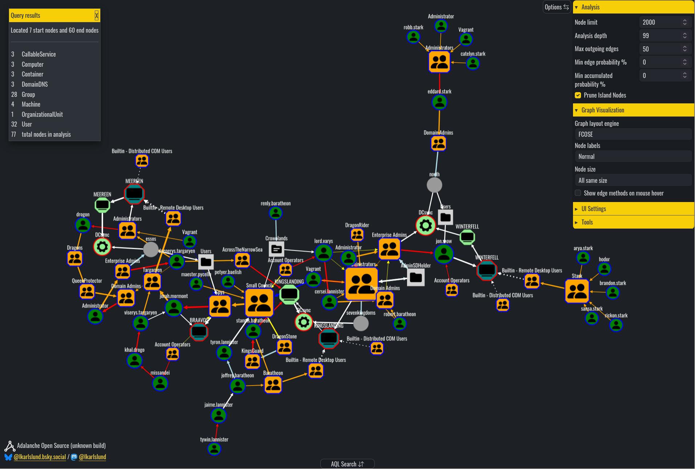

#  Adalanche Open Source

*Attack Graph Visualizer and Explorer*

  

Adalanche gives instant results, showing you what permissions users and groups have in an Active Directory. It is useful for visualizing and exploring who can take over accounts, machines or the entire domain, and can be used to find and show misconfigurations.

## I Can Haz Domain Admin?

Active Directory security is notoriously difficult. Small organizations generally have no idea what they're doing, and way too many people are just added to Domain Admins. 

In large organizations you have a huge number of people with different needs, and they are delegated access to varying degrees of power in the AD. At some point in time, someone makes a mistake, and that can cost you dearly.

Adalanche visualizes delegation issues, kerberoastable accounts, AD CS issues and much, much more.

## Features

Analysis offers in-depth analysis of ownership, ACLs and other node relationships.
The visualization allows you to explore nodes and edges via web based graph UI, in order to find misconfigurations that attackers would use against you if they were to attack your infrastructure.

Adalanche Query Language (AQL) offers comprehensive search abilities in the graph. AQL is a GQL-like language that allows for complex queries.

Adalanche can collect data from: 
  - Active Directory
  - Windows machines
  - VMware vSphere*

Adalanche integrates data from:
  - Active Directory
  - Windows machines (domain joined, or standalone)
  - VMware vSphere(*)
  - CyberArk(*)
  - Password hashes / cracked passwords(*)
  - Tiering models(*)
  - Custom nodes and edges(*)

Reporting feature is in development(*)

(*) = paid version, see [NetSection](https://www.netsection.com) website

## Tell me more

For more details, you can view the [documentation](modules/frontend/html/docs/index.md) here on Github, or from within the Adalanche UI.
