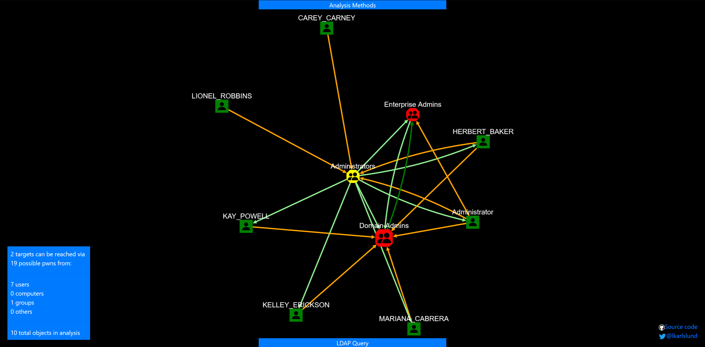
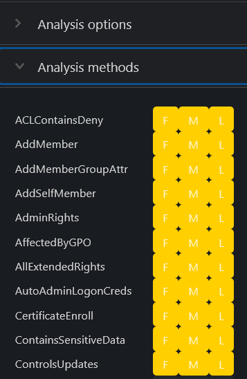
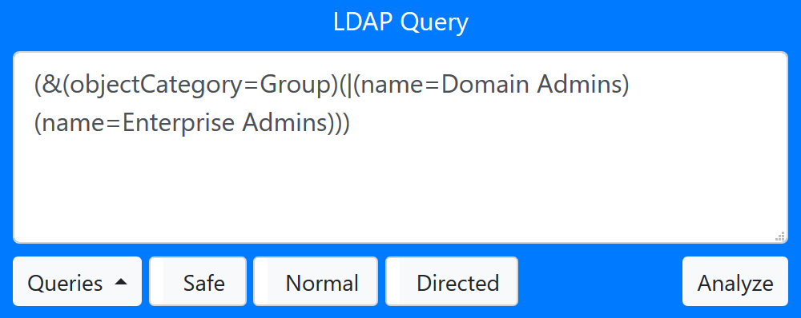
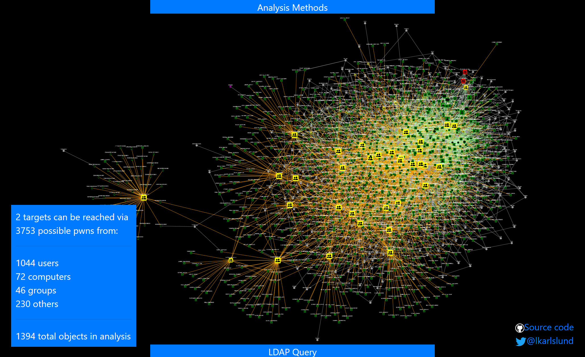
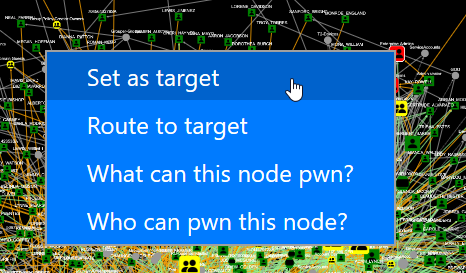
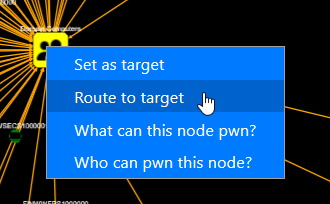
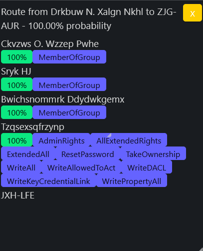

# adalanche - Active Directory ACL Visualizer and Explorer

## I Can Haz Domain Admin?
Active Directory security is notoriously difficult. Small organizations generally have no idea what they're doing, and way too many people are just added to Domain Admins. In large organizations you have a huge number of people with different needs, and they are delegated access to varying degrees of power in the AD. At some point in time, someone makes a mistake, and that can cost you dearly.

### Run adalanche on your own infrastructure
You should ensure you have permission before you run this :-) Though the software is harmless any only uses the LDAP service to read data *any user* can access, your infrastructure/SOC team might get real mad at you none the less.

#### Quick start, choose one of these:
- Build your own:
  - Install go 1.16
  - <code>go build</code> - you will have a binary for your OS
  - <code>build</code> - you will have binaries for Windows, Linux and OSX
- Download the binary artifacts from the "actions" tab for any recent commit
- Download latest release from Releases (actually not preferred, as all releases seem to get outdated a few days later with new commits)

The tool tries to autodetect as much as it can, so running it on a Windows domain joined machine should just work without any parameters:
<code>adalanche.exe</code>

If no command is given, the tool will run in a dump-analyze mode (dump, then analyze). See program options for other possibilities.

If you're on a non-domain joined Windows machine or another OS, you'll need at least the -domain parameter as well.

LDAPS (TLS over port 636) is default. If you're on a lab, and you haven't set up CA yet, you will get connection errors because the computer doesn't trust the AD cert. Either disable certificate validation with the "-ignorecert" switch, or change protocol to LDAP with <code>adalanche -authmode NoTLS -port 389</code>

Create cache file for contoso.local:
<code>adalanche -domain contoso.local -username joe -password Hunter42 dump</code>

Analyze cache file for contoso.local and launch browser:
<code>adalanche -domain contoso.local analyze</code>

### User Interface
When launched, you get to see who can pwn "Domain Admins" and "Enterprise Admins". Query targets are marked with RED. If you get a lot of objects on this one, congratz, you're running a pwnshop.

The below examples loaded from the included domain beyond.local, which is a synthetic domain, that has been heavy handedly been messed up using [BadBlood](https://github.com/davidprowe/BadBlood). You can try the same analysis with:
<code>adalanche -domain beyond.local analyze</code>

Your browser should pop up with:

No really exciting results on this synthetic AD. Yes, some users are Domain Admins and Administrators. But let's expand the search a bit.

#### Analysis Methods
Press the "Analysis Methods" tab on the bottom portion of the page, and you get this:

(more methods has been added since this screenshot)

The tool can look for many scenarios, but defaults to fairly simple ones that can get you control of an object. As this yielded nothing, let's try to expand with all methods enabled. Checking the missing boxes, we submit another query.

#### LDAP query pop-out
When you press the "LDAP Query" tab on the bottom portion of the page, and you get the search interface:

You enter a query for things you want to search for. Optionally you can also add a secondary exclude query, seperating the include and expclude quereries with a comma. Things matching in the exclude query will never get added to the results.

- "Quieries" button is just for inspiration, with some predefined queries to get you going. 
- "Safe"/"Force" button allows you to run requests that returns more than 1000 objects (potentially crashing your browser tab). 
- "Max Depth" can limit results by not going further from a target than this depth.

Analyze:
- Normal searches for other objects that can pwn the selection in your LDAP query (i.e. who can reach these objects)
- Reverse searches for objects that you LDAP query targets can pwn (i.e. what can these objects reach)

I enabled "Force" as I was warned that the analysis would return more than 1000 objects, and pressed "Analyze / Normal".

Whoa - that's a lot. But can all these objects then suddenly do a system takeover? No, not neccesarily, this depends on the analysis methods used. We enabled the CanDelete*, CanCreate* and InheritsSecurity methods.

Let's investigate what's going on here - right click on one of your targets, and choose "Set as target". 

Then right-click on someone else, and choose "Route to target".

Then you'll get a route, which shows the best way to the target.

So here the problem is just a matter of groups being nested members of other groups, but at the very end you see that someone set the DELETE_CHILD flag on the parent container, yielding the right to delete (or potentially move) the target. That does look wrong, doesn't it?

If you examine the "Domain Users" object, you will see that it doesn't have the InheritsSecurity flag, so you can't really pwn it by moving it around.

So try it out on your own data - see what your user can pwn by searching for (&(objectCategory=Person)(Name=YOURLOGIN)) and do a Reverse search. Maybe you'll just end up with the groups that you are a member of, maybe you have access to more than you think ...

Remember, you might get too many results. Limit the selection of targets with (&(attribute=something)(_limit=10)) to just get 10 random targets (see LDAP queries below)

### Operational theory
*adalanche* works a bit differently than other tools, as it dumps everything it can from an Active Directory server, which it then saves to a highly compressed binary cache file for later use. This dump can be done by any unprivileged user, unless the Active Directory has been hardened to prevent this (almost no one does this).

The analysis phase is done on a cache file, so you do not have to be connected to the systems when doing analysis. This way you can explore different scenarios, and ask questions not easily answered otherwise.

### Analysis / Visualization
The tool works like an interactive map in your browser, and defaults to a ldap search query that shows you how to become "Domain Admin" or "Enterprise Admin" (i.e. member of said group or takeover of an account which is either a direct or indirect member of these groups.

### LDAP queries
The tool has its own LDAP query parser, and makes it easy to search for other objects to take over, by using a familiar search language.

**The queries support:**
- case insensitive matching for all attribute names
- checking whether an attribute exists using asterisk syntax (member=*)
- case insensitive matching for string values using equality (=)
- integer comparison using <, <=, > and >= operators
- glob search using equality if search value includes ? or *
- case sensitive regexp search using equality if search value is enclosed in forward slashes: (name=/^Sir.*Mix.*lot$/ (can be made case insensitive with /(?i)pattern/ flags, see https://github.com/google/re2/wiki/Syntax)
- extensible match: 1.2.840.113556.1.4.803 (you can also use :and:) [LDAP_MATCHING_RULE_BIT_AND](https://ldapwiki.com/wiki/LDAP_MATCHING_RULE_BIT_AND) 
- extensible match: 1.2.840.113556.1.4.804 (you can also use :or:) [LDAP_MATCHING_RULE_BIT_OR](https://ldapwiki.com/wiki/LDAP_MATCHING_RULE_BIT_OR) 
- extensible match: 1.2.840.113556.1.4.1941 (you can also use :dnchain:) [LDAP_MATCHING_RULE_IN_CHAIN](https://ldapwiki.com/wiki/LDAP_MATCHING_RULE_IN_CHAIN) 
- custom extensible match: count - returns number of attribute values (member:count:>20 gives groups with more members than 20)
- custom extensible match: length - matches on length of attribute values (name:length:>20 gives you objects with long names)
- custom extensible match: since - parses the attribute as a timestamp and your value as a duration - pwdLastSet:since:<-6Y5M4D3h2m1s (pawLastSet is less than the time 6 years, 5 months, 4 days, 3 hours, 2 minutes and 1 second ago - or just pass an integer that represents seconds directly)
- synthetic attribute: _limit (_limit=10) returns true on the first 10 hits, false on the rest giving you a max output of 10 items
- synthetic attribute: _random100 (_random100<10) allows you to return a random percentage of results (&(objectclass=Person)(_random100<1)) gives you 1% of users
- synthetic attribute: _canpwn - allows you to select objects based on what they can pwn *directly* (&(objectclass=Group)(_canpwn=ResetPassword)) gives you all groups that are assigned the reset password right
- synthetic attribute: _pwnable - allows you to select objects based on how they can be pwned *directly* (&(objectclass=Person)(_pwnable=ResetPassword)) gives you all users that can have their password reset

## Collector module
For Windows systems that are members of your Active Directory domain you can collect more information from the local machines by running the collector executable. It's a 32-bit Windows executable, but works transperently on 64-bit systems. The idea is that you orchestrate it centraliy with a Scheduled Task via a GPO or whatever means you see fit (psexec, login script etc). The collector does not require elevated privileges, and runs fine with either the local system account with pricileges stripped or as a random user.

<code>adalanche-collector.exe -outputpath \\some\share\where\youcanwrite\butnotread</code>

Please remember to secure your UNC path, so member machines can only create/write/modify files, but not read from them. Only you - the analyst - should be able to do so.

You can then import all these files when doing analysis:

<code>adalanche.exe analyze -collectorpath \\your\data\folder</code>

This will give you insight into who uses what systems, service accounts that are domaun users, autoadminlogins, who are local admins, who can RDP into systems and more fun stuff later on :-)

## Detectors and what they mean
| Detector | Explanation |
| -------- | ----------- |
| CreateUser | Permission in ACL allows entity to create user objects in the container |
| CreateGroup | Permission in ACL allows entity to create group objects in the container |
| CreateComputer | Permission in ACL allows entity to create computer objects in the container |
| CreateAnyObject | Permission in ACL allows entity to create any kind of objects in the container |
| DeleteChildrenTarget | Permission in ACL allows entity to delete all children via the DELETE_CHILD permission on the parent |
| DeleteObject | Permission in ACL allows entity to delete any kind objects in the container |
| InheritsSecurity | This flag simply indicates that the object inherits its security ACL from the parent. If it is moved, the permissins will change to what its new parent dictates |
| ACLContainsDeny | This flag simply indicates that the ACL contains a deny entry, possibly making other detections false positives. You can check effective permissions directly on the AD with the Security tab |
| ResetPassword | The ACL allows entity to forcibly reset the user account password without knowing the current password. This is noisy, and will alert at least the user, who then no longer can log in. |
| Owns | The entity owns the object, and can do anything it wishes to it |
| GenericAll | The entity has GenericAll permissions on the object, which means more or less the same as "Owns" |
| WriteAll | The entity is allowed all write operations |
| WritePropertyAll | The entity can write to any property (same as above, ACL is just a bit different) |
| WriteExtendedAll | The entity is allowed to do all extended write operations |
| TakeOwnership | The entity can make itself the owner |
| WriteDACL | The entity can write to the DACL, effectively giving it all permissions after granting them |
| WriteSPN | The entity can freely write to the Service-Principal-Name attributes using SETSPN.EXE or similar tools. You can then kerberoast the account |
| WriteValidatedSPN | The entity can do validated writes to the Service-Principal-Name attributes using SETSPN.EXE or similar tools. You can then kerberoast the account |
| WriteAllowedToAct | The entity is allowed to write to the ms-DS-Allowed-To-Act-On-Behalf-Of-Other-Identity attribute of the object, so we can get it to accept impersonations what would otherwise not work |
| AddMember | The entity can change members to the group via the Member attribute |
| AddMemberGroupAttr | The entity can change members to the group via the Member attribute (the set also contains the Is-Member-of-DL attribute, but you can't write to that) |
| AddSelfMember| The entity can add or remove itself to the list of members |
| ReadMSAPassword | The entity is allowed to read the plaintext password in the object |
| HasMSA | |
| WriteKeyCredentialLink | The entity can write to the msDK-KeyCredentialLink attribute |
| WriteAttributeSecurityGUID | The entity can write to the AttributeSecurityGUID. I'm not sure if this will work, but it has the potential to allows you to add an important attribute to a less important attribute set |
| SIDHistoryEquality | The objects SID-History attribute points to this entity, making them equal from a permission point of view |
| AllExtendedRights | The entity has all extended rights on the object |
| DCReplicationGetChanges | |
| DCReplicationSyncronize | |
| DSReplicationGetChangesAll | |
| ReadLAPSPassword | The entity is allowed to read the plaintext LAPS password in the mS-MCS-AdmPwd attribute |
| MemberOfGroup | The entity is a member of this group |
| HasSPN | The entity has a SPN, and can be kerberoasted by any authenticated user |
| HasSPNNoPreauth | The entity has a SPN, and can be kerberoasted by an unauthenticated user |
| AdminSDHolderOverwriteACL | The entity will get it's ACL overwritten by the one on the AdminADHolder object periodically |
| ComputerAffectedByGPO | The computer object is potentially affected by this GPO. If filtering is in use there will be false positives |
| GPOMachineConfigPartOfGPO | Experimental |
| GPOUserConfigPartOfGPO | Experimental |
| LocalAdminRights | The entity has local administrative rights on the object. This is detected via GPOs or the collector module |
| LocalRDPRights | The entity has the right to RDP to the object. This is detected via GPOs or the collector module. It doesn't mean you pwn the machine, but you can get a session and try to do PrivEsc |
| LocalDCOMRights | The entity has the right to use DCOM against the object. This is detected via GPOs or the collector module |
| LocalSMSAdmins | The entity has the right to use SCCM Configuration Manager against the object. This is detected via the collector module. It does not mean that everyone are SCCM admins, but some are |
| LocalSessionLastDay | The entity was seen having a session at least once within the last day |
| LocalSessionLastWeek | The entity was seen having a session at least once within the last week |
| LocalSessionLastMonth | The entity was seen having a session at least once within the last month |
| HasServiceAccountCredentials | The object uses the entitys credentials for a locally installed service, and can be extracted if you pwn the machine |
| HasAutoAdminLogonCredentials | The object is set to auto login using the entitys credentials which is stored in plain text in the registry for any user to read |
| ScheduledTaskOnUNCPath | The object contains a scheduled task that sits on a UNC path. If you can control the UNC path you can control what gets executed |
| MachineScript | Same as above, just as either a startup or shutdown script. Detected via GPOs |
| WriteAltSecurityIdentities | The entity is allowed to write to the Alt-Security-Identities attribute, so you can put your own certificate there and then authenticate as that user with this certificate |
| WriteProfilePath | The entity can write to the user profile path of the user |
| WriteScriptPath | The entity can write to the script path of the user, giving them instant remote execution when the user logs on |
| CertificateEnroll | The entity is allowed to enroll into this certificate template. That does not mean it's published on a CA server where you're alloed to do enrollment though |

## Current limitations
- A large AD with 500.000 objects results in a file approximately 250MB in size
- adalanche requires a reasonable amount of memory - loading and analyzing the above AD will use about 2.5GB RAM - but RAM is cheap, getting pwned is not.
- There are probably mistakes, false positives and stuff I've overlooked. Feedback is welcome!

# Shoutouts
To everyone messing around with Active Directory - the team behind BloodHound, Will Schroeder @harmj0y, Sean Metcalf @PyroTek3, plus many others that I forgot. The MS API documentation kinda helped, and also other obscure places (stackoverflow lol) where I dug up technical stuff

If you need inspiration on how to use a detected attack path I can highly recommend that you take a look at [PayloadsAllTheThings Active Directory section](https://github.com/swisskyrepo/PayloadsAllTheThings/blob/master/Methodology%20and%20Resources/Active%20Directory%20Attack.md)

## Happy hunting!

Feedback is welcome -> [@lkarlslund](https://twitter.com/lkarlslund)